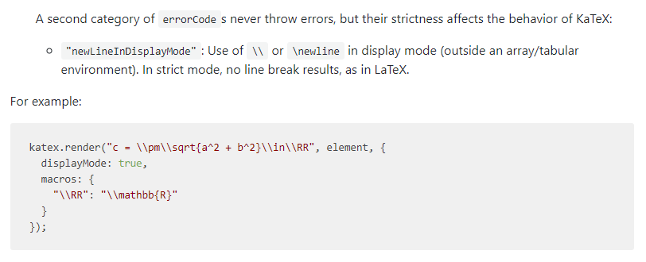

# Data Structure
The concept of abstract data types and the advantages of data abstraction are introduced. Various commonly used abstract data types including vector, list, stack, queue, tree, and set and their implementations using different data structures (array, pointer based structures, linked list, 2-3 tree, B-tree, etc.) will be discussed. Sample applications such as searching, sorting, etc. will also be used to illustrate the use of data abstraction in computer programming. Analysis of the performance of searching and sorting algorithms. Application of data structure principles.
## Mathematics Review
### Exponents
$$
\begin{aligned}   
X^{A}X^{B}&=X^{A+B}  \\\\
\frac{X^{A}}{X^{B}}&=X^{A-B}  \\\\
(X^{A})^{B}&=X^{AB}  \\\\
X^{N}+X^{N}&=2X^{N}  \\\\
2^{N}+2^{N}&=2^{N+1}  \\\\
\end{aligned}
$$
### Logarithms
$$
\begin{aligned}   
X^{A}&=B\ \ \rm{iff}\ \log_{X}B=A \\\\
\log_{A}B&=\frac{\log_{C}B}{\log_{C}A};\ A,B,C>0,\ A\neq 1\\\\
\log AB&=\log A + \log B;\ A,B>0\\\\
\log \frac{A}{B}&=\log A - \log B\\\\
\log (A)^{B}&=B\log A\\\\
\log x&\leq X,\ \rm{for\ all}\ X>0
\end{aligned}
$$
### Series 
$$
\begin{aligned}   
\sum^{N}_{i=0}2^{i}&=2^{N+1}-1\\\\
\sum^{N}_{i=0}A^{i}&=\frac{A^{N+1}-1}{A-1}\\\\
\sum^{N}_{i=0}A^{i}&\leq \frac{1}{A-1},\ 0<A<1,\ N\rightarrow \infin\\\\
\sum^{N}_{i=1}i&=\frac{N(N+1)}{2}\approx \frac{N^{2}}{2}\\\\
\sum^{N}_{i=1}i^{2}&=\frac{N(N+1)(2N+1)}{6}\approx \frac{N^{3}}{3}\\\\
\sum^{N}_{i=1}i^{k}&\approx\frac{N^{k+1}}{|k+1|},\ k\neq -1
\end{aligned}
$$
### Modular Arithmetic
$$
\rm{If}\ A \equiv B (mod\ n),\ \rm{then}\ A+C \equiv B+C (mod\ N),\ \rm{and}\ AD \equiv BD (mod\ N)
$$
###### *Remark: Interesting bug for GitHub markdown for *line switching* in aligned mathematical formula: Using normal $\LaTeX$ expression "\\\\" for line switching does not work as "\\\\" only showed single "\\" in GitHub markdown. In order to switch the line in formular, we need to use "\\\\\\\\" in .md file. But in markdown IDE like VSCode, "\\\\" is enough for switching the line. The reason is related to the [deep copy of macros](https://github.com/yzhang-gh/vscode-markdown/pull/451).

